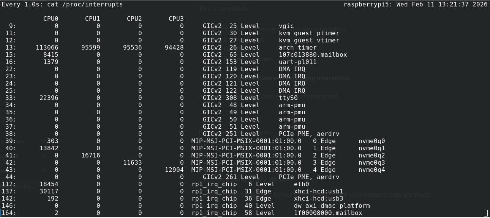
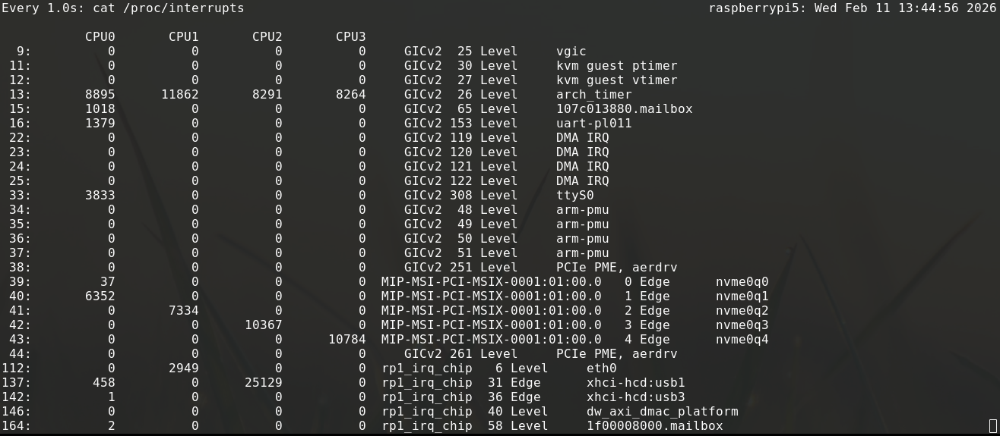

# Raspberry Pi 5 -- Logitech MX Performance Mouse Stutter Fix

## 🎯 Problem

On Raspberry Pi 5 (8GB) running Debian 12 (Bookworm) with GNOME 43
(Wayland or X11), Logitech MX Performance mouse (Unifying USB dongle)
may exhibit:

-   Cursor micro-stutter or jitter

-   Jerky movement every few seconds

-   Lag under network load

-   Mouse becomes smooth when running:

    sudo ip link set eth0 down

This indicates interrupt contention between RP1 Ethernet and USB
controllers.

------------------------------------------------------------------------

## 🧠 Root Cause

The Raspberry Pi 5 uses the RP1 I/O controller which handles:

-   Ethernet (eth0)
-   USB controllers (xhci-hcd)
-   PCIe devices

By default, Linux may assign these interrupts to the same CPU core.

Under network load, Ethernet interrupts can compete with USB mouse
interrupts, causing visible pointer jitter.

------------------------------------------------------------------------

## ✅ What This Fix Does

This repository provides a complete solution that:

1.  Disables Ethernet runtime power management (prevents overnight LAN
    freeze)
2.  Assigns IRQ affinity manually:
    -   eth0 → CPU1
    -   USB2 controller (mouse) → CPU2
    -   USB3 controller → CPU3
3.  Ensures irqbalance does not override manual tuning

Result: Full core isolation and smooth mouse movement under load.

------------------------------------------------------------------------

# 🛠 Step 1 --- Disable Ethernet Runtime Power Management

Check current state:

    cat /sys/class/net/eth0/device/power/control

If it shows:

    auto

Disable it:

    echo on | sudo tee /sys/class/net/eth0/device/power/control

### Make It Permanent

Create udev rule:

    sudo gedit /etc/udev/rules.d/70-eth0-no-pm.rules

Add:

    ACTION=="add", SUBSYSTEM=="net", KERNEL=="eth0", ATTR{{device/power/control}}="on"

Reload:

    sudo udevadm control --reload
    sudo udevadm trigger

------------------------------------------------------------------------

# 🛠 Step 2 --- Identify IRQ Numbers

    cat /proc/interrupts | grep -E "eth0|xhci"

Example:

    112: ... eth0
    137: ... xhci-hcd:usb1
    142: ... xhci-hcd:usb3

------------------------------------------------------------------------

# 🛠 Step 3 --- Assign IRQ Affinity

CPU mask mapping:

  CPU    Mask
  ------ ------
  CPU0   1
  CPU1   2
  CPU2   4
  CPU3   8

Test manually:

    echo 2 | sudo tee /proc/irq/112/smp_affinity
    echo 4 | sudo tee /proc/irq/137/smp_affinity
    echo 8 | sudo tee /proc/irq/142/smp_affinity

Verify:

    cat /proc/interrupts | grep -E "eth0|xhci"

------------------------------------------------------------------------

# 🛠 Step 4 --- Make Permanent (Systemd Service)

Create:

    sudo gedit /etc/systemd/system/irq-affinity-tuning.service

Paste:

    [Unit]
    Description=RP1 IRQ Affinity Tuning
    After=multi-user.target

    [Service]
    Type=oneshot
    ExecStart=/bin/bash -c '\
    echo 2 > /proc/irq/112/smp_affinity; \
    echo 4 > /proc/irq/137/smp_affinity; \
    echo 8 > /proc/irq/142/smp_affinity; \
    '
    RemainAfterExit=yes

    [Install]
    WantedBy=multi-user.target

Enable:

    sudo systemctl daemon-reload
    sudo systemctl enable irq-affinity-tuning.service
    sudo reboot

------------------------------------------------------------------------

# 🛠 Step 5 --- Disable irqbalance (If Installed)

    systemctl status irqbalance

If active:

    sudo systemctl disable --now irqbalance

------------------------------------------------------------------------

# 🎉 Final Result

After reboot:

-   Smooth mouse movement
-   No jitter under network load
-   No LAN freeze after overnight idle
-   Clean interrupt separation per CPU core

Core layout:

  Core   Responsibility
  ------ -----------------
  CPU0   System / timers
  CPU1   Ethernet
  CPU2   USB mouse
  CPU3   USB3 devices

------------------------------------------------------------------------

# 🧪 Tested On

-   Raspberry Pi 5 (8GB)
-   Debian 12 (Bookworm)
-   GNOME 43
-   Wayland & X11
-   Logitech MX Performance (Unifying Receiver)

------------------------------------------------------------------------

# 📄 License

MIT License recommended for this repository.
